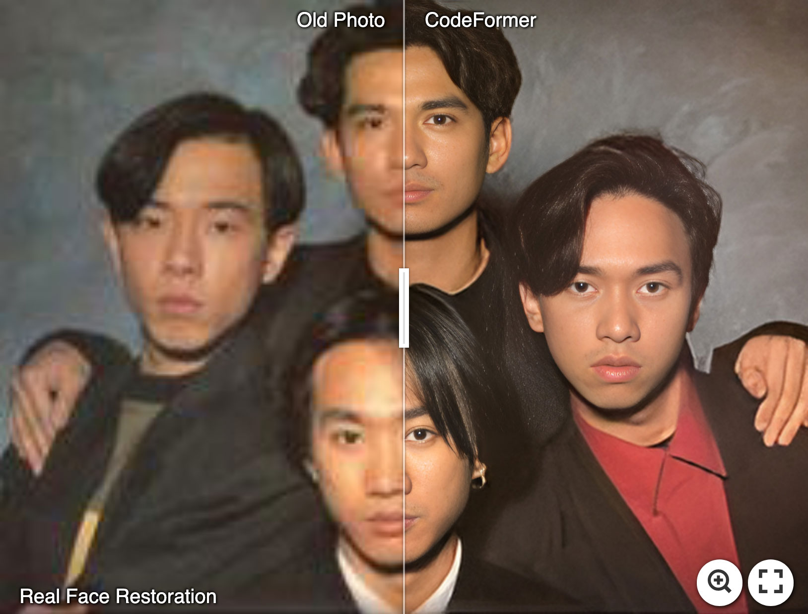
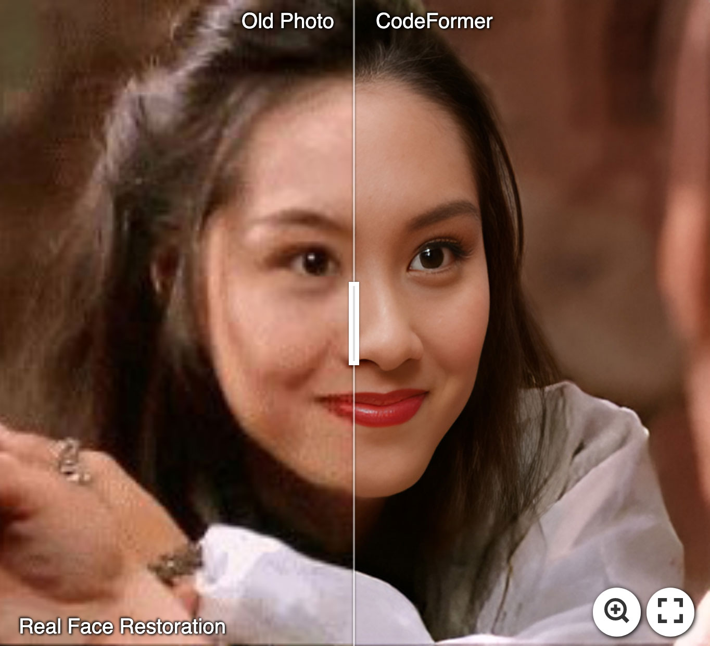
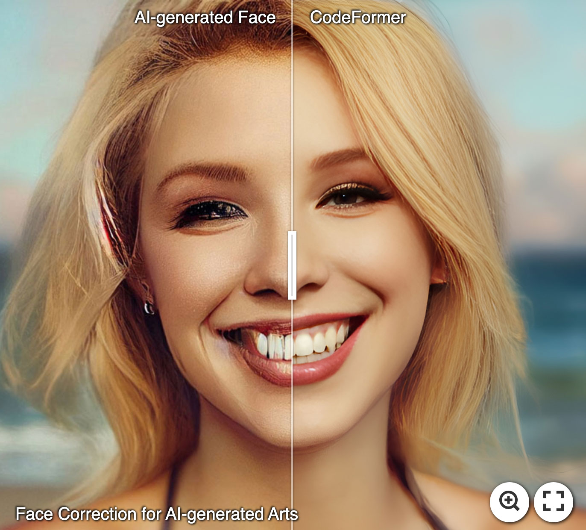

# gRPC face-restoration-worker

A gRPC that exposes [CodeFormer](https://github.com/sczhou/CodeFormer/) model for face restoration
For additional ressources, you can check out the [paper](https://arxiv.org/abs/2206.11253)


## :panda_face: Try Enhancing Old Photos / Fixing AI-arts

[](https://imgsli.com/MTI3NTE2) [](https://imgsli.com/MTI3NTE1) [](https://imgsli.com/MTI3NTIw)

#### Face Restoration

 
 

#### Face Color Enhancement and Restoration

 

#### Face Inpainting

 

## Run the project

```bash
git clone git@github.com:rm-rfred/vit-worker.git
cd vit-worker

# Download the models
bash download_models.sh

# Copy and fill the env file
cp .env.example .env

docker-compose build
docker-compose up -d
```

### Config files

face_restoration_pb2.py and face_restoration_pb2_grpc.py where generated by running :

```bash
bash run_protoc.sh
```

## Inference on GPU

In order to run inference on your GPU, you **must** have :

- NVIDIA driver installed
- NVIDIA container toolkit installed

Check out [here](https://github.com/NVIDIA/nvidia-container-toolkit) how to install it on your local device

Then, set DEVICE=cuda:0 on your .env file

## Why gRPC instead of REST ?

- Higher performances for microservice architecture
- High load APIs
- Better suited for real time / streaming apps

## gRPC architecture example


## Dependencies

Docker version **24.0.7**, build afdd53b
Docker Compose version **v2.23.0**
[NVIDIA container toolkit](https://github.com/NVIDIA/nvidia-container-toolkit)
